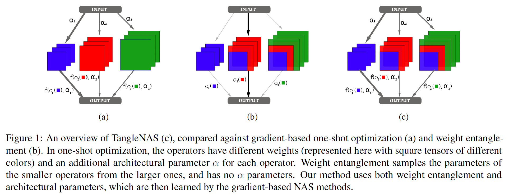

# TangleNAS
Official code for the paper "Weight-Entanglement Meets Gradient-Based Neural Architecture Search"


## Overview
1. [Installation & Dependencies](#Dependencies)
2. [Working Tree and Dataset Preparation](#dataset)
3. [Experiments](#experiments)
    - [Search](#search)
    - [Training and Evaluation](#train)


## 1. Installation & Dependencies<a name="Dependencies"></a>


To install the dependencies:
```bash
conda create --name tanglenas python=3.9
conda activate tanglenas
pip install -r requirements.txt
```

## 2. Working Tree and Dataset Preparation <a name="dataset"></a>
### Code working tree
```bash
├── configs
│   ├── search
│   └── train
├── job_scripts
├── optimizers
│   ├── mixop
│   └── sampler
│   ├── optim_factory.py
├── search_spaces
│   ├── AutoFormer
│   ├── DARTS
│   ├── NB201
│   ├── NATS
│   ├── SwinIR
├── search
├── toy_search_space
├── train
```

The ```configs``` folder contains the configs used for search, finetuning and training the architectures obtained

The ```job_scripts``` folder contains the scripts used for search, finetuning and training the architectures obtained

The ```optimizers``` folder contains the configuratble optimizers used namely darts, drnas and gdas

The ```job_scripts``` folder contains the scripts used for search, finetuning and training the architectures obtained

The ```search_spaces``` folder contains the definition of the search spaces used

The ```toy_search_spaces``` folder contains the code for the search spaces of the toy search spaces.

The ```toy_benchmarks``` folder contains the pickle files for the toy benchmarks we release.

The ```search``` folder contains the code used to perform NAS


### Wandb logging
We use wandb for logging our experimental results. Please setup an account on wandb following instructions here https://docs.wandb.ai/quickstart

### Dataset preparation

```CIFAR10``` and ```CIFAR100``` datasets will be automatically downloaded
Download the ```imagenet-1k``` from [here](https://www.image-net.org/download.php) and update the path to the dataset in the training script. The dataset Imagenet16-120 was downloaded as suggested in the NB201 repo. 

## 3. Experiments <a name="experiments"></a>

### Search  <a name="search"></a>

### Search on the Toy spaces

#### Entangelled cell space

```bash
bash job_scripts/launch_toy_cell_fmnist_we.sh
```
or use the python command 

```python 
python -m search.experiment_search --dataset fashion_mnist --optimizer drnas --searchspace toy_cell --seed 9001 --use_we_v2 --path_to_benchmark toy_benchmarks/entangled_cell_ss_benchmark.pkl
```
We directly query the tabular benchmark in this case to obtain the test performance after search 
#### Conv Macro Space

```bash
bash job_scripts/launch_conv_macro.sh
```
We directly query the tabular benchmark in this case to obtain the test performance after search 
```python 
python -m search.experiment_search --dataset cifar10 --optimizer drnas --searchspace "toy_conv_macro" --seed 9001 --use_we_v2 --path_to_benchmark toy_benchmarks/conv_macro_bench.pkl --train_portion 0.8
```

### Search on the NB201 search space
```bash
bash job_scripts/launch_nb201.sh
```

```bash 
bash job_scripts/launch_nb201_imgnet.sh
```
We directly query the tabular benchmark in this case to obtain the test performance after search 

Alternatively use

```python
python -m search.experiment_search --dataset cifar10 --optimizer drnas --searchspace nb201 --seed 9001 --use_we_v2  --path_to_benchmark /path/to/NAS-Bench-201-v1_0-e61699.pth --train_portion 0.5
```
```python
python -m search.experiment_search --dataset imgnet16_120 --optimizer drnas --searchspace nb201 --seed 9001 --use_we_v2  --path_to_benchmark /path/to/NAS-Bench-201-v1_0-e61699.pth --train_portion 0.5 --data_path /path/to/ImageNet16
```

### Search on the DARTS search space

```bash
bash job_scripts/launch_darts_cifar10.sh
```
Alternatively use

```python
python -m search.experiment_search --dataset cifar10 --train_portion 0.8 --optimizer drnas --searchspace darts  --use_we_v2 --seed 9001 --train_portion 0.5"
```
To evaluate our derived architectures from the darts search space we simply plug in the architectures derived into the training protocol in the [darts](https://github.com/quark0/darts/) repo. The derived architectures can be found in ```train/genotypes.py```

### Search on the AutoFormer search space
```bash
bash job_scripts/job_autoformer_cifar10.sh
```

Alternatively use
```python
python -m torch.distributed.launch --nproc_per_node=2 --use_env search_spaces/AutoFormer/supernet_train_cifar10.py --data-path . --gp --change_qkv --relative_position --mode super --dist-eval --cfg search_spaces/AutoFormer/experiments/supernet/supernet-T.yaml --epochs 500 --warmup-epochs 20 --output "output_autoformer_drnas_cifar10" --batch-size 512 --one_shot_opt drnas --use_we_v2 --data-set CIFAR10 --ratio 0.8
```
```bash
bash job_scripts/job_autoformer_cifar100.sh
```
Alternatively use
```python
python -m torch.distributed.launch --nproc_per_node=2 --use_env search_spaces/AutoFormer/supernet_train_cifar10.py --data-path . --gp --change_qkv --relative_position --mode super --dist-eval --cfg search_spaces/AutoFormer/experiments/supernet/supernet-T.yaml --epochs 500 --warmup-epochs 20 --output "output_autoformer_drnas_cifar100" --batch-size 512 --one_shot_opt drnas --use_we_v2 --data-set CIFAR100 --ratio 0.8
```
```bash
bash job_scripts/job_autoformer_imgnet.sh

```
Alternatively use
```python
python -m torch.distributed.launch --nproc_per_node=2 --use_env search_spaces/AutoFormer/supernet_train.py --data-path /path/to/imagenet --gp --change_qkv --relative_position --mode super --dist-eval --cfg search_spaces/AutoFormer/experiments/supernet/supernet-T.yaml --epochs 500 --warmup-epochs 20 --output "output_autoformer_drnas_imgnet" --batch-size 512 --one_shot_opt drnas --use_we_v2 --amp --data-set IMNET
```

We use the same evaluation pipeline as AutoFormer to evaluate the searched model in AutoFormer-T space
### Search on the MobileNetv3 search space
```bash
bash job_scripts/job_imgnet_mobilenetv3.sh
```

Alternatively use
```python
python -m torch.distributed.launch --nproc_per_node=8 --use_env search_spaces/MobileNetV3/finetune/mobilenet_finetune.py --one_shot_opt drnas --opt_strategy "alternating"  --valid_size 10000
```
We use the same evaluation pipeline as Once-For-All (OFA) to evaluate the searched model in MobileNetV3 space
### One-Shot NanoGPT Search with TinyStories

#### Install dependencies
1. pip install tiktoken datasets

#### Prepare the data
1. Run `python data/prepare/tinystories` from the root directory of the project.
2. Copy the `train.bin` and `validation.bin` to `search_spaces/nanoGPT/data/tinystories`
3. Rename `validation.bin` to `val.bin` in `search_spaces/nanoGPT/data/tinystories`

#### One-Shot Search on the NanoGPT supernet (DrNAS/SPOS)

The configuration for search is taken from `search_spaces/nanoGPT/config/train_tinystories_{drnas/spos}.py`

To run the search:

```python search_spaces/nanoGPT/train_search.py config=search_spaces/nanoGPT/config/train_tinystories_{drnas/spos}.py```

The job script (DDP, with 4 GPUs) can be found in `job_scripts/train_nanogpt_{drnas/spos}.sh`


#### Training a model from scratch

There are two ways to specify the config of the model to train from scratch:
1. Load it from the arch trajectory pickle file of a previous one-shot search
2. Load it from a custom arch config file

You can use either one option when running `train_base.py`, but not both (it will throw an assertion error if you attempt to do this).

#### 1. Load from arch trajectory
`python search_spaces/nanoGPT/train_base.py config=search_spaces/nanoGPT/config/train_tinystories_base.py --arch_traj_load_path output_tinystories/out_search_drnas_0.5_42_7500_20230824-182026 --max_iters=12000`

The directory is of the format out_search_<optimizer>_<train_portion>_<seed>_<max_iters>_<formatted_time>

#### 2. Load from config file
`python search_spaces/nanoGPT/train_base.py config=search_spaces/nanoGPT/config/train_tinystories_base.py --arch_config_file=search_spaces/nanoGPT/config/nanoGPT_train_ts.config --max_iters=12000`

When training from scratch, you can optionally provide a `--val_portion` argument, which will tell the script to split the train data into train and validation splits. By default, this split is disabled, and the validation loss in the logs will be entered as 1e9.


